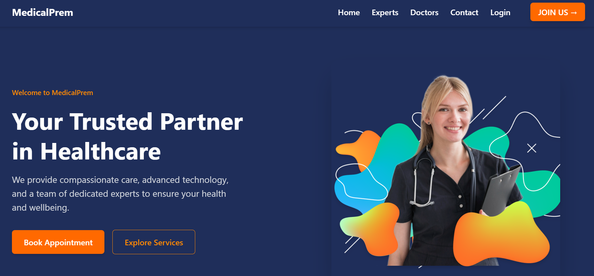

# MedicalPrem - Hospital Website

MedicalPrem is a fully responsive and modern hospital-themed website built using **HTML5**, **Tailwind CSS**, and enhanced with **AOS (Animate On Scroll)** and **Font Awesome** icons. This project is ideal for hospitals, clinics, or healthcare platforms looking for a clean, user-friendly, and professional web presence.

> ✅ **This is my best and most complete Figma to HTML/CSS conversion project.**  
> 🔥 It reflects my skills in responsive design, component structuring, and pixel-perfect implementation.

## 🖥️ Live Preview

**Live Site:** [https://vercel.com/mhrxs-projects/medical-prem](https://vercel.com/mhrxs-projects/medical-prem)

## 📸 Screenshot



## 📌 Key Features

- ✅ Fully Responsive (Mobile, Tablet, Desktop)
- 🎨 Tailwind CSS utility-first styling
- ✨ AOS scroll-based animations
- 🚀 Fast performance and optimized layout
- 📧 Newsletter subscription UI
- 🧑‍⚕️ Dedicated sections: Hero, Services, Experts, Doctors, Testimonials, Contact
- 📦 Clean and modern user interface

## 🔧 Technologies Used

- HTML5  
- Tailwind CSS  
- AOS (Animate on Scroll)  
- Font Awesome Icons  
- Responsive Design

## 🚀 How to Use

1. Clone the repository:
   ```bash
   git clone https://github.com/your-username/medicalprem.git
   ```

2. Open `index.html` in your browser.

3. Customize content and Tailwind classes as needed.

## 🙋‍♂️ About Me

**Mehedi Hasan Rabbi**  
Front-End Web Developer  

📧 Email: [mehedihasanrabbivip@gmail.com](mailto:mehedihasanrabbivip@gmail.com)  
🌐 GitHub: [https://github.com/mehedihasanrabbivip](https://github.com/mehedihasanrabbivip)

> 💎 This project demonstrates my ability to convert complex Figma designs into real-world, responsive websites with professional-quality UI.

## 📄 License

This project is open-source and available under the **MIT License**.